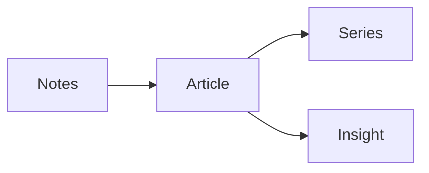

Content on this site moves through three stages. The site is being rebuilt, so this section is a placeholder.

```mermaid
flowchart LR
  N[Notes] --> A[Article]
  A --> S[Series]
  A --> I[Insight]
```

A series of $n$ parts is read in order: part $k$ assumes parts $1, \dots, k-1$.
