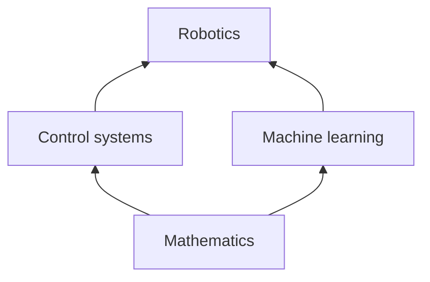

Learning paths are built bottom-up, from foundations to applications. Placeholder overview:

```mermaid
flowchart BT
  M[Mathematics] --> C[Control systems]
  M --> L[Machine learning]
  C --> R[Robotics]
  L --> R
```

A path of $n$ stages with $m$ resources each lists $n \cdot m$ entries in total.
