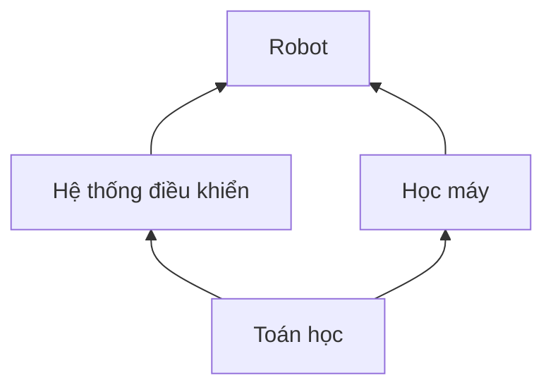

Lộ trình học được xây từ dưới lên, từ nền tảng đến ứng dụng. Phần tổng quan tạm:

```mermaid
flowchart BT
  M[Toán học] --> C[Hệ thống điều khiển]
  M --> L[Học máy]
  C --> R[Robot]
  L --> R
```

Một lộ trình gồm $n$ giai đoạn, mỗi giai đoạn $m$ tài liệu, sẽ có tổng cộng $n \cdot m$ mục.
